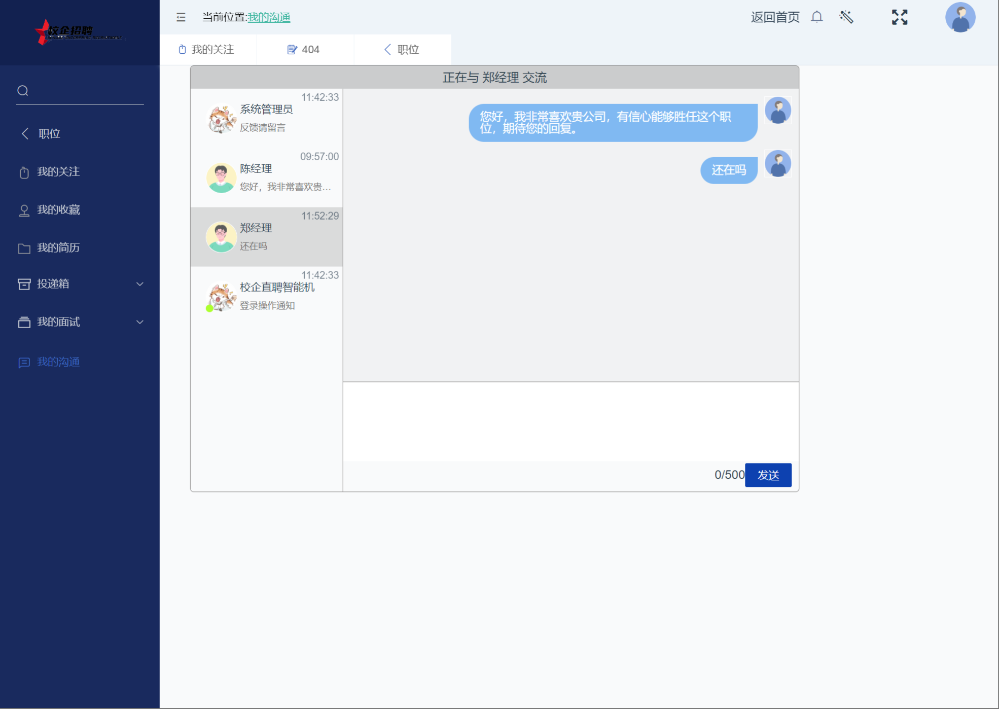
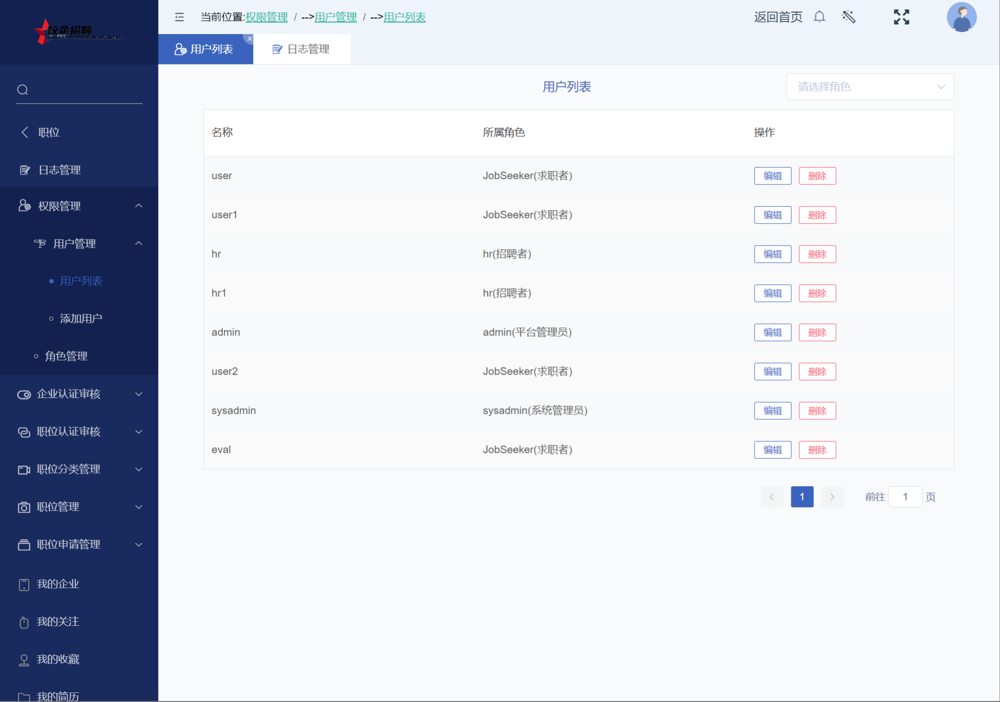

### 作者QQ：1556708905(支持修改、 部署调试、 支持代做毕设)

#### 支持代做任何毕设论、接网站建设、小程序、H5、APP、各种系统等

**毕业设计所有选题地址 [https://github.com/zhengjianzhong0107/allProject](https://github.com/zhengjianzhong0107/allProject)**

**博客地址：
[https://blog.csdn.net/2303_76227485/article/details/132209323](https://blog.csdn.net/2303_76227485/article/details/132209323)**

**视频演示：
[https://www.bilibili.com/video/BV1W14y1q7nw/](https://www.bilibili.com/video/BV1W14y1q7nw/)**

 

## 基于Java+Springboot+Vue的招聘系统(源码+数据库)093

## 一、系统介绍

本系统前后端分离

本系统分为管理员、HR、用户三种角色

用户角色包含以下功能：

- 登录、注册、简历(搜索、投递和收藏)、hr联系、我的关注、我的收藏、我的简历、简历投递管理、面试管理、个人中心、密码修改

HR角色包含以下功能：

- 登录、注册、职位管理、职位申请管理(筛选简历)、面试管理、我的企业管理、我的沟通、个人中心、密码修改

管理员角色包含以下功能：

- 包括用户和HR所有功能、日志管理、用户管理、角色管理、企业认证管理、职位认证管理、职位类别管理、个人中心、密码修改

## 二、所用技术

后端技术栈：

- Springboot
- mybatisPlus
- mysql
- JWT
- websocket
- redis
- SpringMvc

前端技术栈：

- Vue
- Vue-router
- axios
- element-ui

## 三、环境介绍

基础环境 :IDEA/eclipse, JDK 1.8, Mysql5.7及以上,tomcat8,Node.js(14.21),Maven3.6

所有项目以及源代码本人均调试运行无问题 可支持远程调试运行

## 四、页面截图

### 1、用户页面

### 2、HR后台

### 3、管理员后台

## 五、浏览地址

- 前台访问路径：http://localhost:8080/#/index
- 后台访问路径：http://localhost:8080/#/about
  
  账号密码：
- 管理员  root/123456
- HR    hr/123456
- 用户    user/123456

## 六、安装教程

1. 使用Navicat或者其它工具，在mysql中创建对应名称的数据库，并执行项目的sql文件里面的sql；
2. 使用IDEA/Eclipse导入recruit-sys项目，导入时，若为maven项目请选择maven; 等待依赖下载完成；
3. 修改application.yml里面的mail配置和redis配置,application-dev.yml里面的数据库配置
4. vscode或idea打开recruit-web项目，
5. 在编译器中打开terminal，执行npm install 依赖下载完成后执行 npm run dev,执行成功后会显示访问地址

 
